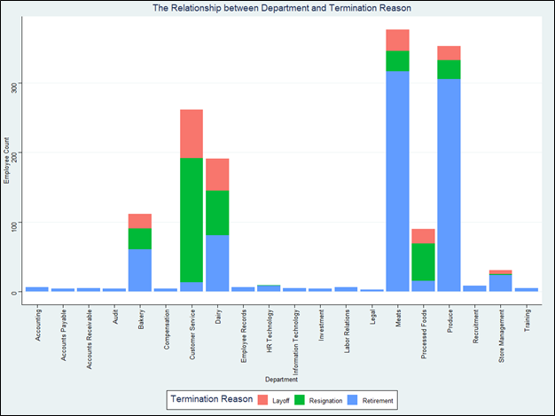

# 📊 Employee Attrition Analysis in R

An in-depth HR analytics project using **R programming** to uncover insights about employee attrition, retirement, layoffs, and gender balance across departments and stores in British Columbia, Canada. The project uses real employee datasets to explore patterns, visualize results, and provide actionable recommendations to HR.

---

## 📌 Project Overview

- **Course**: Programming for Data Analysis (PFDA)
- **Institution**: Asia Pacific University (APU)
- **Student**: Wong Horng Woei (TP055241)
- **Language**: R (Tidyverse Ecosystem)
- **Tool**: RStudio
- **Dataset**: Employee records (status, age, department, location, termination reason, etc.)

---

## 🎯 Objective

To investigate hidden HR issues and answer key business questions such as:

- Why do employees leave?
- What age group faces the most layoffs?
- Which jobs are in high demand in crowded cities?
- Is there gender inequality?
- What is the structure of each store’s workforce?

---

## 🛠️ Tools & Libraries Used

| Package | Purpose |
|--------|---------|
| `dplyr` | Data manipulation |
| `ggplot2` | Visualization |
| `magrittr` | Pipe operations |
| `tibble` | Better data frames |
| `stringr` | String operations |
| `forcats` | Factor reordering |
| `ggthemes` | Graph styling |

---

## 📁 Data Preparation

- Corrected **spelling issues** in fields like `Resignaton`, `Receiveable`.
- Removed redundant columns: `recorddate_key`, `gender_short`, etc.
- Renamed columns for readability.
- Created new derived fields:
  - `JobPosition` (grouped job titles)
  - `HireYear`, `TerminationYear`
  - `AgeClass` (e.g., 25-34, 35-44)
- Converted dates to proper `Date` type and categorical features to `factor`.

---

## 🔍 Exploratory Data Analysis

- Year-wise employee activity
- City-wise and department-wise employee count
- Most common job titles and termination reasons
- Gender distribution across roles and years

---

## ❓ Business Questions Answered

### 1️⃣ Why did employees leave?

- Retirement is the most common reason.
- Young workers (age 21) in Customer Service often resign due to low compensation and recognition.
- Meats & Produce departments see most retirements around age 60–65.

### 2️⃣ What age group faces most layoffs?

- Layoffs occurred mainly in 2014–2015.
- Age group **25–34** in **Fort Nelson** experienced the most layoffs.
- Related to inflation and workforce oversizing.

### 3️⃣ Which jobs are in demand in crowded cities?

- **Vancouver** has the most employees.
- Store #42 has the largest headcount.
- Most common role: **Cashier**.

### 4️⃣ Is there gender inequality?

- Gender distribution is fairly balanced across all years.
- Slightly more females hired and terminated.
- Departmental preferences vary: females in accounting, males in IT.

### 5️⃣ What’s the structure of store organizations?

- Store #46 (Victoria) has the largest workforce but no store manager.
- Store manager presence is inconsistent across locations.
- Smaller stores often operate without store managers.

---

## 💡 Special Features

### ✅ `fct_reorder()`  
Improves bar chart readability by sorting categorical axes.

### 🎨 `ggthemes`  
Improves chart aesthetics with themes like `theme_economist()` and `theme_stata()`.

### 📊 Population Pyramid Charts  
Used to compare gender distribution over time in a mirrored format.

---

## 📈 Sample Visualizations

```markdown
### 📊 Termination Reasons by Department


### 👥 Gender Distribution Over Time


## 📌 Key Insights
- Employee attrition varies significantly by department, age, and location.

- Data preprocessing (cleaning, grouping, reformatting) greatly enhances analysis quality.

- Graphical features such as pyramid charts and reorder functions clarify trends.

## 🏁 Conclusion
This project demonstrates how R can transform raw HR data into valuable insights. From attrition patterns to store staffing strategies, the findings empower HR teams to make informed decisions using data.